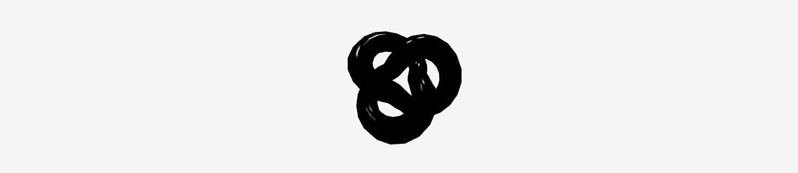

# Portfolio website

A website showcasing some of my projects while also showing some of my skills as a developer.

## Instructions:

- Install NPM packages 'npm install'
- Start server 'npm run start-dev' and open http://localhost:3000 to view in the browser.

## Technologies used:

- [Node.js](https://nodejs.org/en/)
- [Express](https://expressjs.com)
- [React](https://reactjs.org/)
- [Three.js](https://threejs.org/)

